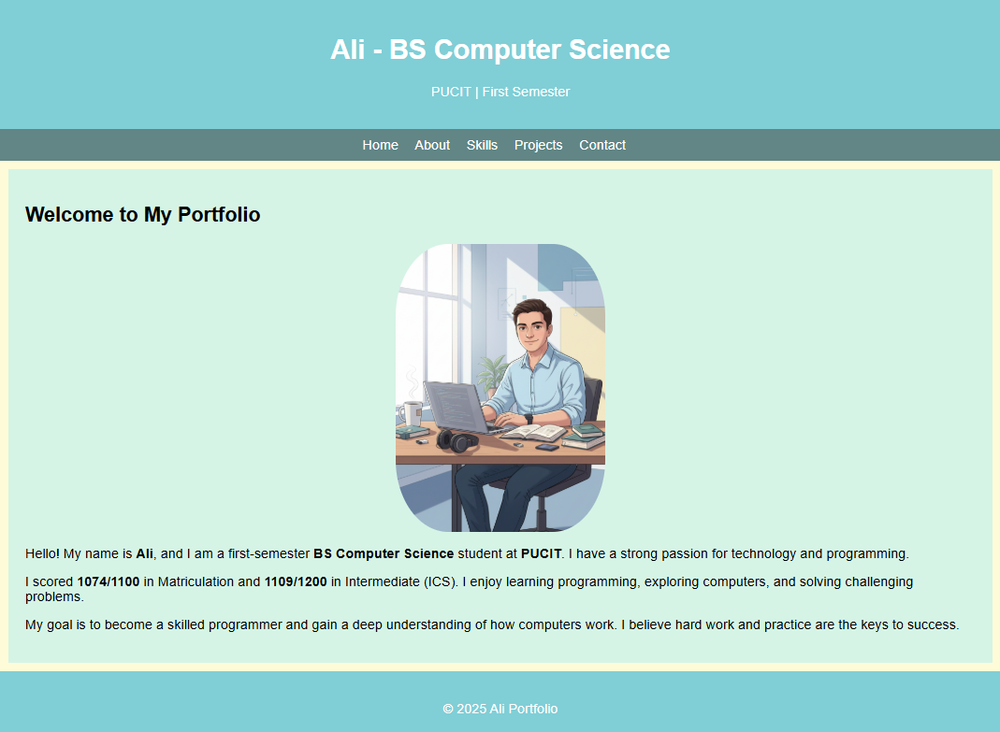
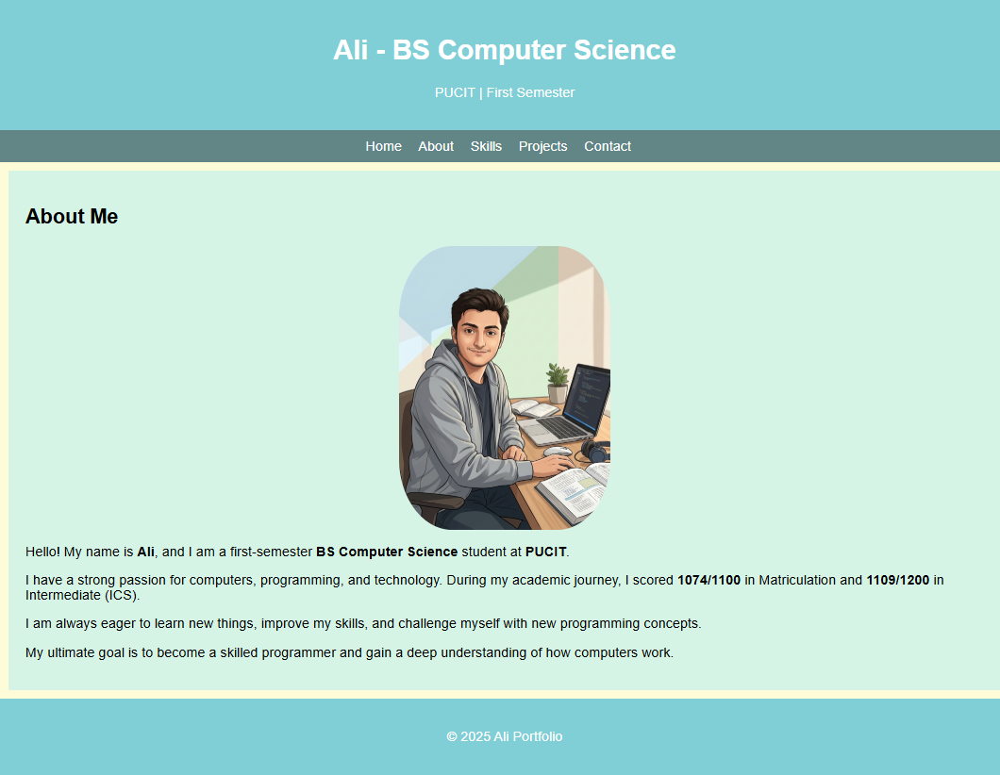
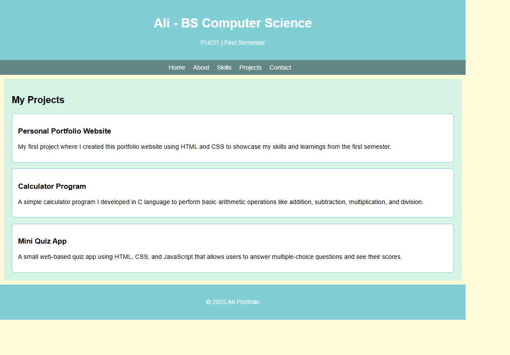
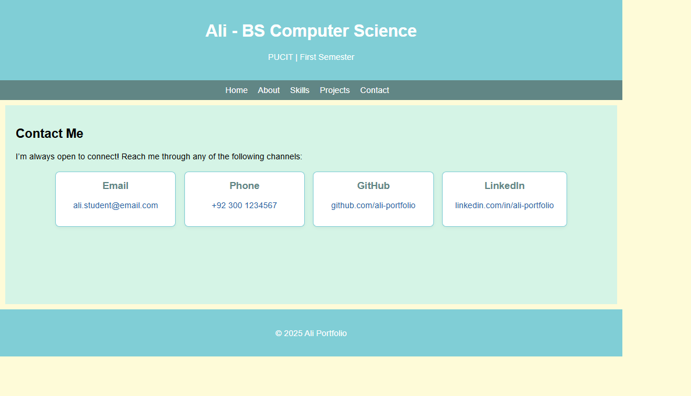

# Ali Portfolio

A professional and modern personal portfolio website built with HTML and CSS.

---

## 📄 Description

**Ali Portfolio** is a responsive and visually appealing personal website designed to showcase your skills, projects, and contact information. It provides a clean and organized layout to highlight your professional profile and achievements.

---

## ✨ Features / Key Sections

- **Home:** Welcome section with a brief introduction.
- **About:** Personal background and professional summary.
- **Skills:** List of technical and soft skills.
- **Projects:** Portfolio of completed or ongoing projects.
- **Contact:** Contact form and details for easy communication.

---

## 🖼️ Project Images

| Home | About Me |
|------|----------|
|  |  |

| Skills | Projects | Contact |
|--------|----------|---------|
|  |  |  |

---

## 🚀 Installation / How to Run

1. **Clone the repository:**
   ```bash
   git clone https://github.com/ali4129944-cs/ali-portfolio.git
   ```
2. **Navigate to the project folder:**
   ```bash
   cd ali-portfolio
   ```
3. **Open `index.html` in your web browser.**

---

## 🛠️ Technologies Used

- **HTML5**
- **CSS3**

---

> Designed and developed by Ali Iftikhar.
